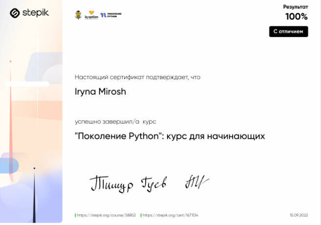

# Iryna Mirosh

## A civil engineer

---

# Contact Info

- **Location:** Minsk, Belarus
- **Phone:** +375 33 380 88 66
- **E-mail:** hishi@inbox.ru
- **GitHub:** irina-mir

# About me

I have a higher education in the specialty: "Industrial and Civil Engineering". I have been working as a design engineer for over 10 years.
I am interested in developing websites and applications, so I decided to enroll in a Front-End developer course at RSSchool.

# Skills

- HTML5
- CSS3
- Git/GitHub
- VS Code

# Code Example

```
function countBy(x, n) {
  let z = [];

  return z;
}
```

# Education

- **Polotsk State University:**
  Industrial and Civil Engineering
- **stepik.org:**
  Python for beginners: https://stepik.org/course/58852/syllabus
  
- RS School Course «JavaScript/Front-end. Stage 0» (in progress)

# Languages:

- Russian - native.
- English - B1.
